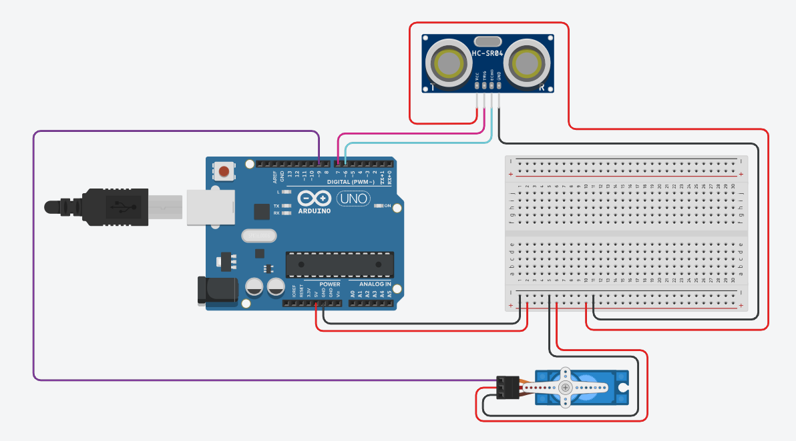
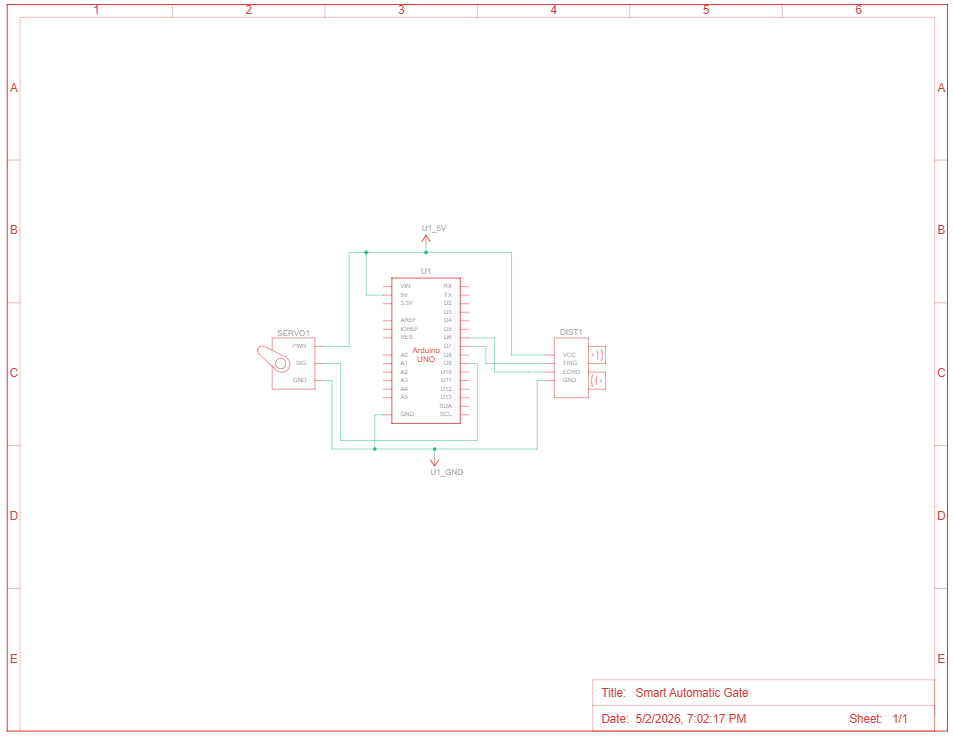

# 🚧 Smart Automatic Gate

> An Arduino-based automatic gate system that uses an ultrasonic sensor to detect approaching objects and controls a servo motor to open and close a gate autonomously.


---

## 📖 Overview

The **Smart Automatic Gate** is a proximity-triggered gate controller built on an Arduino UNO. An HC-SR04 ultrasonic sensor continuously measures the distance to nearby objects. When something comes within **100 cm**, the gate (driven by a servo motor) swings open automatically and stays open for 3 seconds before closing again — no button press or human interaction needed.

---

## ✨ Features

- 📡 **Contactless detection** — HC-SR04 ultrasonic sensor measures distance without physical contact
- 🔁 **Automatic open/close** — gate opens on approach and closes once the path is clear
- ⏱️ **Timed hold-open** — stays open for 3 seconds to allow passage before auto-closing
- 🖥️ **Serial monitoring** — real-time distance and gate state logs via Serial Monitor (9600 baud)
- 🔒 **State-aware logic** — uses a boolean flag to prevent redundant servo commands

---

## 🛠️ Hardware Components

| Component | Quantity |
|-----------|----------|
| Arduino UNO | 1 |
| HC-SR04 Ultrasonic Sensor | 1 |
| SG90 Servo Motor | 1 |
| Breadboard | 1 |
| Jumper Wires | As needed |

---

## 🔌 Pin Connections

| Component | Pin | Arduino Pin |
|-----------|-----|-------------|
| HC-SR04 | VCC | 5V |
| HC-SR04 | GND | GND |
| HC-SR04 | TRIG | Digital 7 |
| HC-SR04 | ECHO | Digital 6 |
| Servo Motor | Signal | Digital 9 |
| Servo Motor | VCC | 5V |
| Servo Motor | GND | GND |

---

## 🔌 Circuit Diagram

> Built and simulated in Tinkercad

**Breadboard View:**



**Schematic View:**



---

## 🚀 Getting Started

### Prerequisites

- Arduino IDE (1.8.x or 2.x)
- `Servo.h` library — included with the Arduino IDE by default

### Installation

1. **Clone the repository**

```bash
git clone https://github.com/deep-chatterjee/Smart-Automatic-Gate.git
cd Smart-Automatic-Gate
```

2. **Open the sketch**

   - Open `Smart_Automatic_Gate.ino` in the Arduino IDE
   - Select your board: **Arduino UNO**
   - Select the correct **COM port**

3. **Upload to your board**

   - Click **Upload**
   - Open **Serial Monitor** (baud rate: `9600`) to observe distance readings and gate state

---

## 💻 How It Works

```
HC-SR04 sends ultrasonic pulse
          ↓
Arduino measures echo return time
          ↓
Calculates distance (cm) = duration × 0.034 / 2
          ↓
    Distance < 100 cm?
      ↙           ↘
    YES             NO
     ↓               ↓
Servo → 90°      Servo → 0°
(Gate Opens)    (Gate Closes)
    ↓
Wait 3 seconds
    ↓
Resume polling
```

---

## 📁 Project Structure

```
Smart-Automatic-Gate/
├── Smart_Automatic_Gate.ino              # Arduino sketch
├── images/
│   ├── Smart_Automatic_Gate_Circuit.png      # Tinkercad breadboard view
│   └── Smart_Automatic_Gate_Schematic.png    # Tinkercad schematic view
└── README.md
```

---

## 🧠 What I Learned

- Interfacing the HC-SR04 ultrasonic sensor using `pulseIn()` for accurate time-of-flight measurement
- Controlling a servo motor with the built-in `Servo.h` library
- Implementing state-based logic with boolean flags to avoid unnecessary actuator commands
- Debugging embedded systems in real time using Arduino Serial Monitor

---

## 🔮 Future Improvements

- Add an IR or PIR sensor as a secondary detection method for improved reliability
- Introduce an LCD display to show distance and gate status locally
- Implement a password-protected override (keypad or RFID) for manual control
- Add a warning buzzer or LED indicator that activates before the gate moves
- Wireless control via Bluetooth module (HC-05) or Wi-Fi (ESP8266)

---

## 👤 Author

**Deep Chatterjee**  
[GitHub](https://github.com/deep-chatterjee)

---

## 📄 License

This project is licensed under the MIT License — see [LICENSE](LICENSE) for details.
